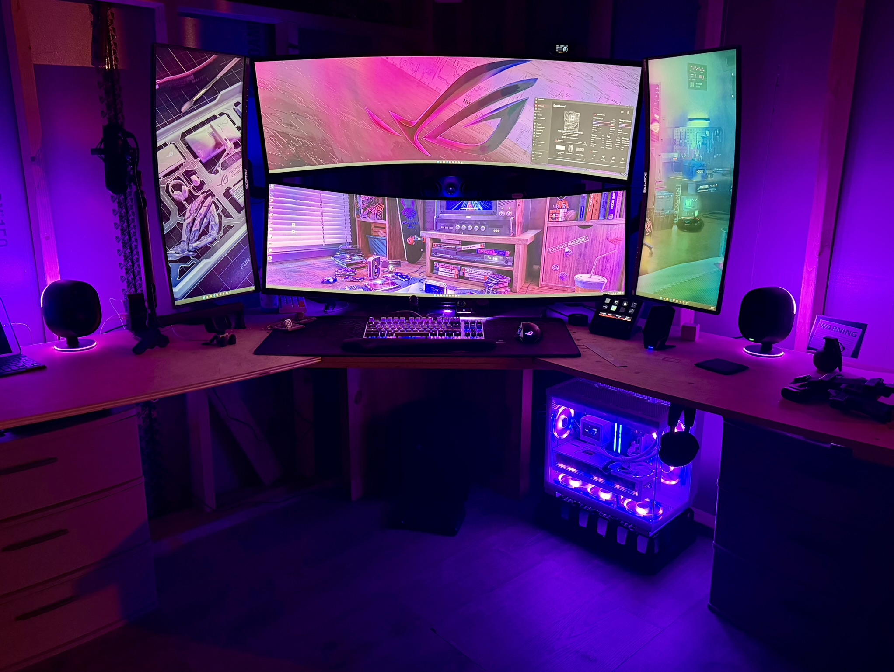

# Visual Gallery

This page collects lightweight visual proof artifacts for the current published snapshot.
These visuals support the written report without trying to replace it.

## Snapshot Context

- Snapshot date: 2026-04-15
- Focus: battlestation presentation, network validation, and public-facing proof points
- Primary report: [G3-ROG-ACTUAL_System_Health_Report.md](G3-ROG-ACTUAL_System_Health_Report.md)

## Repo Social Preview

### Final Share Card

- Asset: [social-preview_2026-04-16.png](../assets/social/social-preview_2026-04-16.png)
- Format: `PNG`
- Use: GitHub social/share preview asset
- Notes: final locked repo asset supplied by the repo owner

## Battlestation

### Current Setup Photo

- Capture date: 2026-04-16
- View: full desk, monitor stack, and under-desk chassis presentation
- Notes: this is the clean public-facing battlestation image for the current repo presentation

### Motion Clip

- [Download battlestation clip](../assets/gallery/g3rog-actual_2026-04-16.mov)
- Format: `.mov`
- Use: optional ambient proof-of-setup asset rather than a primary document artifact

## Network Validation

### Desktop Speedtest.net Result

- Provider: Frontier
- Server: Secaucus, NJ
- Result: 2347.18 Mbps down / 2224.44 Mbps up
- Ping: 6 ms

### eero Max 7 Gateway Result

- Connection: wired internet via eero Max 7 gateway
- Result: 2.36 Gbps down / 2.55 Gbps up
- Captured: 2026-04-15 at 20:17 local time

## Notes

- These images are included as proof artifacts, not as long-term telemetry dashboards.
- Redact or replace future screenshots if they expose details you would not want indexed publicly.
- GitHub's custom social preview image still requires a Settings UI upload step; this asset is ready for that use.
